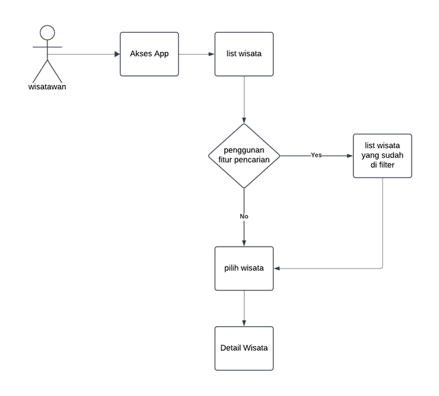

# Mobile Apps Pengenalan Wisata Indonesia

**Bussines Domain:** Mobile App Wisata Indonesia  
**Bussines Process:** Pengenalan dan pencarian Wisata Indonesia  
**Status:** Release  
**Tanggal:** November 2024  

## Introduction

Indonesia memiliki beragam destinasi wisata yang menarik, mulai dari wisata alam, budaya, sejarah, hingga wisata modern. Namun, wisatawan sering kali mengalami kesulitan dalam memperoleh informasi yang mudah terkait tempat-tempat wisata di Indonesia. Oleh karena itu, diperlukan sebuah aplikasi mobile yang dapat memberikan informasi mengenai destinasi wisata di Indonesia untuk memudahkan wisatawan dalam mencari dan mengeksplorasi tempat-tempat menarik di seluruh Indonesia, dengan aplikasi ini para wisatawan dapat mencari wisata berdasarkan daerah yang akan di  kunjungi dan wisatawan juga dapat melihat informasi singkat seperti gambar, deskripsi, dan Alamat wisatanya.

## Objective

Memudahkan para wisatawan untuk mencari informasi destinasi wisata di Indonesia.

## Scope

**Batasan:**  
- Tidak ada batasan akses.  

**Kriteria:**  
- Wisatawan dapat memperoleh informasi wisata dengan mudah melalui fitur pencarian.

## Business Requirement

### Business Requirement Definition

**Jenis Layanan:** Layanan Informasi  
**Definisi:**  
Indonesia merupakan negara yang kaya akan destinasi wisata yang memikat, mencakup wisata alam, budaya, sejarah, hingga wisata modern. Namun, keterbatasan informasi sering kali menjadi hambatan bagi wisatawan untuk menemukan tempat wisata yang sesuai dengan kebutuhan mereka. Untuk mengatasi masalah ini, diperlukan sebuah aplikasi mobile berbasis teknologi yang dapat memberikan informasi lengkap dan terstruktur mengenai berbagai destinasi wisata di Indonesia.
Aplikasi ini dirancang untuk memudahkan wisatawan dalam mencari dan mengeksplorasi tempat-tempat wisata di seluruh Indonesia dengan fitur pencarian berdasarkan daerah atau nama destinasi. Pengguna dapat dengan mudah mengakses informasi singkat yang mencakup gambar, deskripsi, dan Alamat dari setiap destinasi wisata. Dengan antarmuka yang intuitif dan pengalaman pengguna yang optimal, aplikasi ini bertujuan untuk menjadi solusi praktis dalam mendukung pengembangan pariwisata Indonesia, sekaligus memberikan pengalaman yang nyaman dan informatif bagi wisatawan domestik maupun internasional.

**Abstrak:**  
Indonesia memiliki beragam destinasi wisata yang menarik, mulai dari wisata alam, budaya, sejarah, hingga wisata modern. Namun, wisatawan sering kali mengalami kesulitan dalam memperoleh informasi yang mudah terkait tempat-tempat wisata di Indonesia. Oleh karena itu, diperlukan sebuah aplikasi mobile yang dapat memberikan informasi mengenai destinasi wisata di Indonesia untuk memudahkan wisatawan dalam mencari dan mengeksplorasi tempat-tempat menarik di seluruh Indonesia, dengan aplikasi ini para wisatawan dapat mencari wisata berdasarkan daerah yang akan di  kunjungi dan wisatawan juga dapat melihat informasi singkat seperti gambar, deskripsi, dan Alamat wisatanya.

### Penjelasan Fungsi

#### Fungsi Teknis
1. **List Wisata**  
   Pada fitur ini berisi list-list wisata Indonesia yang berupa gambar, regional, dan nama wisata
2. **Detail Wisata**  
   Pada fitur ini Wisatawan dapat melihat informasi lebih lengkap seperti gambar, nama, alamat, deskripsi dengan mengklik wisata yang dipilih pada list wisata.
3. **Pencarian Wisata**  
   Pada fitur ini wisatawan dapat mencari wisata yang di inginkan dengan memberikan regional dan nama wisata yang ingin di cari.

#### Fungsi Strategis
1. **Kinerja**  
   Memberikan solusi bagi wisatawan yang kesulitan mencari informasi wisata di Indonesia.
2. **Keunggulan**  
   Antarmuka yang intuitif dan mudah digunakan.

## Fungsional & Spesifikasi

### Process Flows

1. wisatawan membuka app dan dapat melihat seluruh list destinasi wisata
1. Wisatawan dapat mencari informasi wisata berdasarkan lokasi atau nama.
2. Sistem menampilkan daftar wisata yang sesuai.
3. Wisatawan dapat memilih destinasi untuk melihat detail informasi.

### digram process flows

### Spesifikasi
1. **Framework:** Flutter  
2. **Pubspec Assets:** Penggunaan untuk pengelolaan file aset.  
3. **Models:**  
   - `models/wisata_model.dart` untuk mendefinisikan struktur data destinasi wisata, dan untuk selanjutnya di panggil dan di tampilkan pada home dan detail wisata.
4. **Data:**  
   - `data/wisata_data.dart` untuk mengisi data destinasi wisata dengan class wisata pada `models/wisata_model.dart`.

